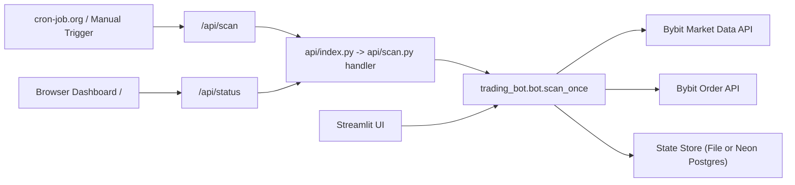

# Crypto Alert Bot (Bybit)

Rule-based crypto scanner + execution engine with Vercel API/dashboard mode and optional Streamlit UI.

It can:
- scan symbols
- generate `BUY_LIMIT / WAIT / SELL` actions
- optionally execute live Bybit orders with safety locks
- track state/journal/performance
- show closed-trade PnL and grouped **PnL by token** in the dashboard

Live execution is enforced as Bybit **spot-only** (no derivatives/futures).

## Architecture



Runtime behavior:
- Vercel/API mode: scheduled scans via `cron-job.org`, returns JSON.
- Vercel dashboard mode: `GET /` serves monitoring UI, reading snapshot from `GET /api/status`.
- Local/UI mode: interactive scans from Streamlit.
- State: local file or Postgres (`Neon` recommended on Vercel).

## Repository Layout

| Path | Purpose |
|---|---|
| `api/index.py` | Vercel Python entrypoint shim (`/api`) |
| `api/scan.py` | Vercel serverless scan endpoint (`/api/scan`) |
| `apps/crypto_alert_bot.py` | CLI bot entrypoint |
| `apps/ui_dashboard.py` | Streamlit dashboard entrypoint |
| `apps/streamlit_app.py` | Deploy-friendly Streamlit entrypoint |
| `trading_bot/bot.py` | Core scanning, risk, execution, journal |
| `trading_bot/bybit_client.py` | Bybit HTTP/signing helpers |
| `trading_bot/state_store.py` | File/Postgres state persistence backend |
| `configs/config.json` | Active config used in runs/deploy |
| `configs/config.example.json` | Starter template |
| `configs/presets/*.json` | Optional preset profiles |
| `scripts/preflight_deploy.py` | Deployment safety checks |
| `scripts/run_stack.sh` | Local bot + UI runner |

## Quick Start

1. Create active config and env file:

```bash
cp configs/config.example.json configs/config.json
cp .env.example .env
```

2. Install dependency:

```bash
pip install -r requirements.txt
```

3. Run one scan test:

```bash
python3 apps/crypto_alert_bot.py --config configs/config.json --once
```

4. Run UI:

```bash
python3 -m streamlit run apps/ui_dashboard.py
```

## Execution Modes (Single Switch)

Use one key to switch behavior:

```env
TRADING_BOT_EXECUTION_MODE=paper   # or demo or live
```

Mode behavior:

| Mode | Orders submitted? | Endpoint | Real money? |
|---|---|---|---|
| `paper` | No | market-data only | No |
| `demo` | Yes | Bybit testnet | No |
| `live` | Yes | Bybit mainnet | Yes |

Important:
- Runtime mode comes from `TRADING_BOT_EXECUTION_MODE`.
- `demo` automatically forces testnet endpoint at runtime.
- `live` requires `TRADING_BOT_ALLOW_MAINNET=true` when using mainnet URL.

## Command Cheatsheet

| Use case | Command |
|---|---|
| One scan only | `python3 apps/crypto_alert_bot.py --config configs/config.json --once` |
| Continuous local bot | `python3 apps/crypto_alert_bot.py --config configs/config.json` |
| Package entrypoint | `python3 -m trading_bot --config configs/config.json` |
| UI only | `python3 -m streamlit run apps/ui_dashboard.py` |
| Bot + UI stack | `./scripts/run_stack.sh` |
| Preflight safety audit | `python3 scripts/preflight_deploy.py --config configs/config.json --target vercel --scheduler cron-job.org` |

## Decision Tree

Use this quick path selector:

```text
Need fastest local check?
  -> Run one scan:
     python3 apps/crypto_alert_bot.py --config configs/config.json --once

Need visual dashboard?
  -> Streamlit UI:
     python3 -m streamlit run apps/ui_dashboard.py

Need local continuous bot loop?
  -> Bot CLI:
     python3 apps/crypto_alert_bot.py --config configs/config.json

Need cloud scheduled scans?
  -> Deploy API on Vercel + schedule via cron-job.org:
     /api/scan endpoint with token auth

Need exchange-submitted but safe testing?
  -> TRADING_BOT_EXECUTION_MODE=demo + demo API keys + live locks + preflight

Need real-money execution?
  -> TRADING_BOT_EXECUTION_MODE=live + mainnet allow flag + mainnet API keys + preflight
```

## Config Guide

Main file: `configs/config.json`

### High-impact sections

| Section | Key fields | Why it matters |
|---|---|---|
| `symbols` | e.g. `BTCUSDT`, `ETHUSDT` | Fixed watchlist each cycle |
| `exchange` | `category` (`spot` or `linear`) | Selects Spot vs Futures market type on Bybit |
| `spot_discovery` | `enabled`, `add_count`, `min_turnover_usdt`, `min_price_change_pct` | Auto-adds trending Bybit spot pairs |
| `price_filter` | `enabled`, `max_price_usdt`, `apply_to_watchlist`, `apply_to_spot_discovery` | Hard gate by token price (e.g. only <= `1.0`) |
| `strategy` | EMA/RSI/pullback/TP/SL + `regime_filter` | Entry/exit behavior and choppy-market gating |
| `risk` | `risk_per_trade_pct`, `max_position_notional_usdt`, `max_open_positions`, `max_daily_loss_pct`, `compounding.autoscale` | Position sizing + circuit breakers |
| `execution` | `mode`, `assume_filled_on_submit`, `live_safety`, `bybit.spot_native_tpsl_on_entry`, `bybit.spot_submit_exit_order` | Paper vs live, live locks, and how spot exits are handled |
| `liquidity_filter` | `max_spread_pct`, `min_turnover_24h_usdt` | Avoid illiquid setups |
| `journal` | `enabled`, `max_closed_trades`, `max_execution_events` | Performance + execution-event history retention |

### Presets

| Profile | Path |
|---|---|
| Paper conservative | `configs/presets/paper.conservative.json` |
| Paper balanced | `configs/presets/paper.balanced.json` |
| Paper aggressive | `configs/presets/paper.aggressive.json` |
| Live aggressive | `configs/presets/live.aggressive.json` |

Switch preset:

```bash
cp configs/presets/paper.balanced.json configs/config.json
```

### Auto-Scale Gating (optional)

If `risk.compounding.autoscale.enabled=true`, compounding only scales position notional above base cap when performance thresholds pass:

- minimum trades in lookback window
- minimum win rate
- minimum profit factor
- minimum net PnL
- maximum allowed drawdown

If thresholds are not met, bot stays at base `risk.max_position_notional_usdt`.

## Environment Variables

The app auto-loads `.env` locally. Keep real secrets only in `.env` or platform secret manager.

### Core mode switch

| Variable | Value |
|---|---|
| `TRADING_BOT_EXECUTION_MODE` | `paper`, `demo`, or `live` |

### Required locks for `demo` and `live`

| Variable | Required value |
|---|---|
| `TRADING_BOT_ALLOW_LIVE` | `true` |
| `TRADING_BOT_LIVE_ACK` | exact phrase: `I_UNDERSTAND_LIVE_TRADING_RISK` |
| `TRADING_BOT_ALLOW_MAINNET` | `false` for demo, `true` for real live |

### API key mapping by mode

| Mode | Keys used |
|---|---|
| `paper` | none required |
| `demo` | `BYBIT_API_KEY_DEMO` + `BYBIT_API_SECRET_DEMO` (fallback to main keys if empty) |
| `live` | `BYBIT_API_KEY` + `BYBIT_API_SECRET` |

Copy-paste examples:

Demo (testnet):

```env
TRADING_BOT_EXECUTION_MODE=demo
TRADING_BOT_ALLOW_LIVE=true
TRADING_BOT_LIVE_ACK=I_UNDERSTAND_LIVE_TRADING_RISK
TRADING_BOT_ALLOW_MAINNET=false
BYBIT_API_KEY_DEMO=your_demo_key
BYBIT_API_SECRET_DEMO=your_demo_secret
```

Real live (mainnet money):

```env
TRADING_BOT_EXECUTION_MODE=live
TRADING_BOT_ALLOW_LIVE=true
TRADING_BOT_LIVE_ACK=I_UNDERSTAND_LIVE_TRADING_RISK
TRADING_BOT_ALLOW_MAINNET=true
BYBIT_API_KEY=your_mainnet_key
BYBIT_API_SECRET=your_mainnet_secret
```

For Bybit **spot live mode**, set `execution.assume_filled_on_submit` to `false` so fills are exchange-synced (safer than simulated fills).
By default, spot entries attach native TP/SL to the entry order via:
`execution.bybit.spot_native_tpsl_on_entry=true` (recommended).
With native TP/SL enabled, default exit behavior is:
`execution.bybit.spot_submit_exit_order=false` (recommended) so Bybit closes positions via TP/SL and the bot avoids duplicate market-exit sells.
If TP/SL protective orders are missing in live mode, bot falls back to submit a market exit for safety.
In paper mode with this handoff setup, trend-only `SELL_NOW` is ignored to better mirror live TP/SL-driven closes.
Only if you intentionally disable that protection should you set:
`execution.live_safety.allow_unprotected_spot_entry=true`.

### Vercel/API specific

| Variable | Purpose |
|---|---|
| `TRADING_BOT_REQUIRE_SCAN_AUTH=true` | Protect `/api/scan` and `/api/status` |
| `TRADING_BOT_SCAN_TOKEN=<secret>` | `/api/scan` execution token (`Authorization: Bearer <token>`) |
| `TRADING_BOT_STATUS_TOKEN=<secret>` | Required read-only token for `/api/status`; must be different from `TRADING_BOT_SCAN_TOKEN` |
| `TRADING_BOT_ALLOWED_ORIGIN=<https://your-dashboard-domain>` | Optional CORS allow-origin for cross-origin dashboards (leave empty for same-origin only) |
| `TRADING_BOT_ALLOW_LIVE_ON_VERCEL` | `true` only if you intentionally allow live orders on Vercel |
| `TRADING_BOT_SCAN_LOCK_TTL_SECONDS=180` | Overlap lock TTL for `/api/scan` (prevents cron+manual double-run) |

If mode is `demo` or `live` on Vercel, also set:

```env
TRADING_BOT_ALLOW_LIVE_ON_VERCEL=true
```

### Neon/PostgreSQL state backend

| Variable | Purpose |
|---|---|
| `TRADING_BOT_STATE_BACKEND=postgres` | Enable Postgres persistence |
| `NEW_TRADING_BOT_POSTGRES_URL=<neon_url>` | Preferred Neon connection string (`sslmode=require`) |
| `TRADING_BOT_POSTGRES_URL=<neon_url>` | Legacy compatibility DB URL |
| `TRADING_BOT_POSTGRES_TABLE` | Optional table override (default: `trading_bot_state_store`) |
| `TRADING_BOT_CLOSED_TRADES_TABLE` | Optional closed-trade journal table (default: `trading_bot_closed_trades`) |
| `TRADING_BOT_POSTGRES_FALLBACK_TO_FILE` | Optional resiliency toggle (default `true`): fallback to local file state if Postgres is temporarily unavailable |
| `TRADING_BOT_STATE_STORAGE_KEY` | Optional fixed key for bot state payload |
| `TRADING_BOT_STATUS_STORAGE_KEY` | Optional fixed key for `/api/status` snapshot payload |

Notes:
- Table is auto-created on first run.
- Closed trades are also journaled into a dedicated Postgres table (`trading_bot_closed_trades`) for easier SQL/audit visibility.
- Execution events are persisted in bot state (`journal.max_execution_events`) so dashboard can show recent history across cycles.
- If `TRADING_BOT_STATE_BACKEND=file`, old JSON file behavior is used.
- With `TRADING_BOT_POSTGRES_FALLBACK_TO_FILE=true`, scans keep running during temporary DB outages (recommended for uptime).

## Deploy with Vercel + cron-job.org

This repository uses:
- Vercel for API hosting (`/api/scan`)
- `cron-job.org` for scheduling

### Deploy steps

1. Push repo to GitHub.
2. Import repo in Vercel.
3. Add Vercel env vars:
   - live/auth vars (table above)
   - Neon vars (`TRADING_BOT_STATE_BACKEND=postgres`, `NEW_TRADING_BOT_POSTGRES_URL=...`)
4. Deploy.

### cron-job.org job

Use URL:

```text
https://<your-app>.vercel.app/api/scan?config=configs/config.json
```

Set request method to `POST` and add HTTP header in cron-job.org:

```text
Authorization: Bearer <TRADING_BOT_SCAN_TOKEN>
```

Recommended schedule: match cron interval to your strategy candle interval.  
Current `configs/config.json` uses `5m`, so run cron every 5 minutes.

If a manual trigger overlaps with cron, `/api/scan` now returns HTTP `409` with code `SCAN_LOCKED`.  
This is expected and protects state/snapshots from overlapping writes.

### Manual API test (`/api/scan` is POST-only)

```bash
curl -sS -X POST "https://<your-app>.vercel.app/api/scan?config=configs/config.json" \
  -H "Authorization: Bearer <TRADING_BOT_SCAN_TOKEN>"
```

### Manual status test (`/api/status` is GET with status token)

```bash
curl -sS "https://<your-app>.vercel.app/api/status" \
  -H "Authorization: Bearer <TRADING_BOT_STATUS_TOKEN>"
```

## Streamlit Cloud (Optional)

You can also deploy UI on Streamlit Cloud using:
- app file: `apps/streamlit_app.py`
- secrets in Streamlit: same live vars if live mode is needed

## Safety Checklist

- Start in `paper` first.
- Use minimal `max_position_notional_usdt` before increasing size.
- Keep `TRADING_BOT_REQUIRE_SCAN_AUTH=true`.
- Rotate API keys immediately if exposed.
- Run preflight before every deploy:

```bash
python3 scripts/preflight_deploy.py --config configs/config.json --target vercel --scheduler cron-job.org
```

## Troubleshooting

### SSL / API hostname issues

If `api.bybit.com` has SSL/DNS problems on your network, keep both endpoints in config:

```json
"exchange": {
  "name": "bybit",
  "base_url": "https://api.bytick.com",
  "backup_base_urls": ["https://api.bybit.com"],
  "category": "spot"
}
```

### No trades executing

Check:
- signal exists (`BUY_LIMIT`)
- price/liquidity filters allow it
- risk/cooldown/circuit breaker not blocking
- live env locks all satisfied

### State resets on cloud

If `TRADING_BOT_STATE_BACKEND=file`, state may reset on redeploy/cold start.  
Use Neon Postgres (`TRADING_BOT_STATE_BACKEND=postgres`) for persistent production state.
